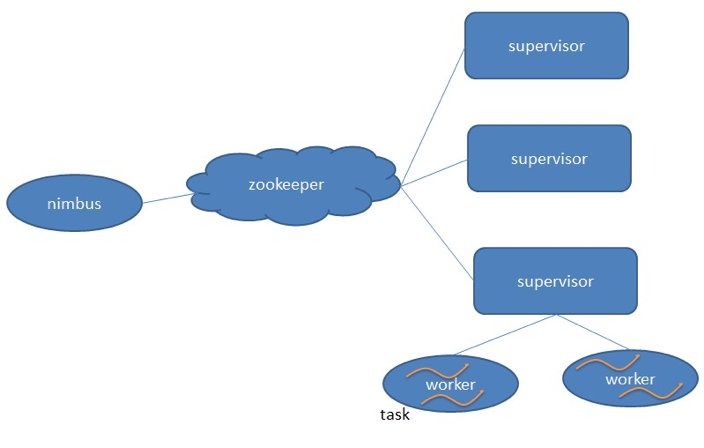
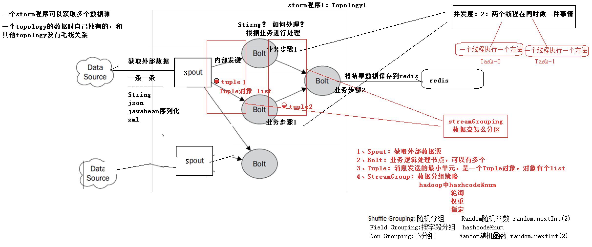
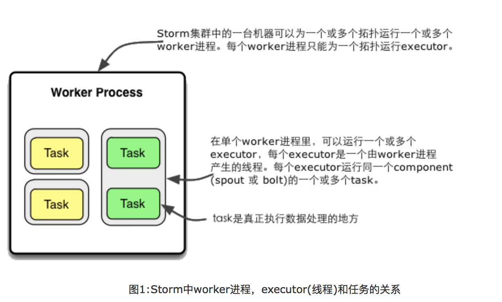
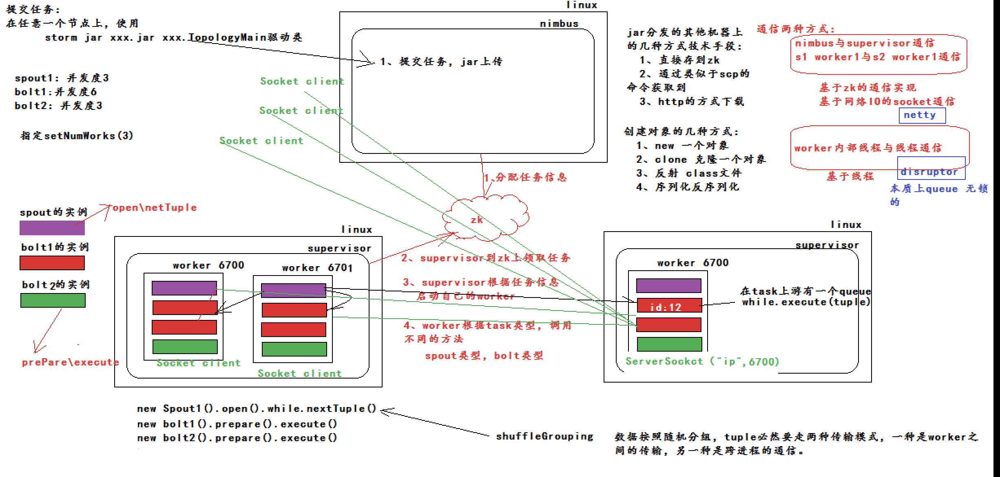

# JStorm
JStorm源码学习:主要包含Storm集群启动、Nimbus启动、Supervisor启动、Executor创建和启动
## Storm编程模型
 

Nimbus：负责资源分配和任务调度。 

Supervisor：负责接受nimbus分配的任务，启动和停止属于自己管理的worker进程。---通过配置文件设置当前supervisor上启动多少个worker。 

Worker：运行具体处理组件逻辑的进程。Worker运行的任务类型只有两种，一种是Spout任务，一种是Bolt任务 。

Task：worker中每一个spout/bolt的线程称为一个task. 在storm0.8之后，task不再与物理线程对应，不同spout/bolt的task可能会共享一个物理线程，该线程称为executor。 

## Storm编程模型

DataSource：外部数据源

Spout：接受外部数据源的组件，将外部数据源转化成Storm内部的数据，以Tuple为基本的传输单元下发给Bolt

Bolt:接受Spout发送的数据，或上游的bolt的发送的数据。根据业务逻辑进行处理。发送给下一个Bolt或者是存储到某种介质上。介质可以是Redis可以是mysql，或者其他。

Tuple：Storm内部中数据传输的基本单元，里面封装了一个List对象，用来保存数据。

StreamGrouping:数据分组策略

7种：shuffleGrouping(Random函数),Non Grouping(Random函数),FieldGrouping(Hash取模)、Local or ShuffleGrouping 本地或随机，优先本地。	

## Storm并发
在Storm集群上运行的拓扑主要包含以下的三个实体：1、Worker进程 2、Executors 3、Tasks(任务)

一个正在运行的拓扑由很多worker进程组成，这些worker进程在Storm集群的多台机器上运行。一个worker进程属于一个特定的拓扑并且执行这个拓扑的一个或多个component（spout或者bolt)的一个或多个executor。一个worker进程就是一个Java虚拟机(JVM)，它执行一个拓扑的一个子集。

一个executor是由一个worker进程产生的一个线程，它运行在worker的Java虚拟机里。一个executor为同一个component(spout或bolt)运行一个或多个任务。一个executor总会有一个线程来运行executor所有的task,这说明task在executor内部是串行执行的。

真正的数据处理逻辑是在task里执行的，在父executor线程执行过程中会运行task。在代码中实现的每个spout或bolt是在全集群中以很多task的形式运行的。一个component的task数量在这个拓扑的生命周期中是固定不变的，但是一个component的executor(线程)数量会随着时间推移发生变化。这说明以下条件一直成立：threads数量 <= task数量。默认情况下task数量被设置成跟executor的数量是一样的，即Storm会在每个线程上执行一个任务(这通常是你想要的)。

## Storm架构
架构

Nimbus：任务分配

Supervisor：接受任务，并启动worker。worker的数量根据端口号来的。

Worker:执行任务的具体组件（其实就是一个JVM）,可以执行两种类型的任务，Spout任务或者bolt任务。

Task：Task=线程=executor。 一个Task属于一个Spout或者Bolt并发任务。

Zookeeper：保存任务分配的信息、心跳信息、元数据信息。

## Worker与topology

一个worker只属于一个topology,每个worker中运行的task只能属于这个topology。反之，一个topology包含多个worker，其实就是这个topology运行在多个worker上。

一个topology要求的worker数量如果不被满足，集群在任务分配时，根据现有的worker先运行topology。如果当前集群中worker数量为0，那么最新提交的topology将只会被标识active，不会运行，只有当集群有了空闲资源之后，才会被运行。

## Storm的ack-fail机制

Storm中有个特殊的task名叫acker，他们负责跟踪spout发出的每一个Tuple的Tuple树（因为一个tuple通过spout发出了，经过每一个bolt处理后，会生成一个新的tuple发送出去）。当acker（框架自启动的task）发现一个Tuple树已经处理完成了，它会发送一个消息给产生这个Tuple的那个task。

Acker的跟踪算法是Storm的主要突破之一，对任意大的一个Tuple树，它只需要恒定的20字节就可以进行跟踪。

Acker跟踪算法的原理：acker对于每个spout-tuple保存一个ack-val的校验值，它的初始值是0，然后每发射一个Tuple或Ack一个Tuple时，这个Tuple的id就要跟这个校验值异或一下，并且把得到的值更新为ack-val的新值。那么假设每个发射出去的Tuple都被ack了，那么最后ack-val的值就一定是0。Acker就根据ack-val是否为0来判断是否完全处理，如果为0则认为已完全处理。

要实现ack机制：

1，spout发射tuple的时候指定messageId

2，spout要重写BaseRichSpout的fail和ack方法

3，spout对发射的tuple进行缓存(否则spout的fail方法收到acker发来的messsageId，spout也无法获取到发送失败的数据进行重发)，看看系统提供的接口，只有msgId这个参数，这里的设计不合理，其实在系统里是有cache整个msg的，只给用户一个messageid，用户如何取得原来的msg貌似需要自己cache，然后用这个msgId去查询，

3，spout根据messageId对于ack的tuple则从缓存队列中删除，对于fail的tuple可以选择重发。

4,设置acker数至少大于0；Config.setNumAckers(conf, ackerParal);
## JStorm源码分析文件
[JStorm源码学习-01-Storm执行脚本.pdf](https://github.com/oeljeklaus-you/JStorm/blob/master/JStorm源码学习-01-Storm执行脚本.pdf)

